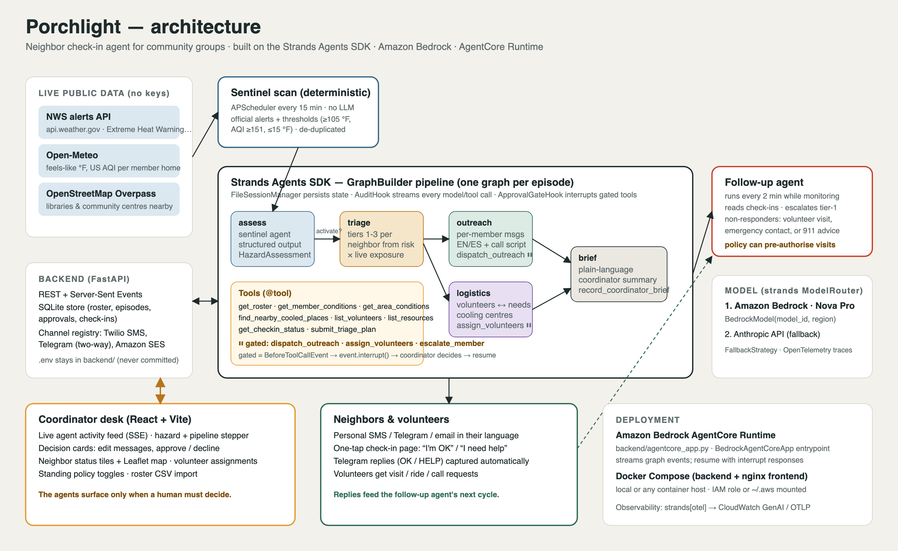

# Porchlight

**A neighbor check-in agent for community groups, built with the Strands Agents SDK.**

When dangerous heat, smoke, a freeze or an outage threatens a neighborhood, Porchlight reads the official alert, works out which neighbors are actually in danger, writes each of them a personal message in their language, lines up volunteers and cooling centers — and then **stops and waits for a human to approve**. After the messages go out it reads the replies people actually write, reminds whoever goes quiet three times and then stops and flags them, and routes a real volunteer to whoever needs one.

*Agents for Humans Hackathon · **Good Neighbor Agents** track · MIT licensed*



## Why

In the 2021 heat dome, 69 people died in one Oregon county. 71% of them lived alone ([Multnomah County](https://www.multco.us/help-when-its-hot/news/2021-heat-killed-72-people-multnomah-county-most-were-older-lived-alone-had)). They died at home, because nobody reached them in time. Every agency's advice is the same sentence — *check on your neighbors* — and doing it falls to one volunteer with a spreadsheet and a phone. NYC runs exactly this program by hand: 1,942 wellness checks in a year, one at a time ([NYC Health](https://www.nyc.gov/assets/doh/downloads/pdf/about/climate-health-strategy.pdf)).

**Who it's for:** the block captain, the parish coordinator, the mutual-aid dispatcher — the one person holding a neighborhood's contact list together. Porchlight is the automation layer for programs that already exist, not a replacement for them and not a replacement for 911.

Every figure above and in the demo is sourced in [`docs/sources.md`](docs/sources.md).

## Try it in three minutes

No AWS account needed — console mode logs every message instead of sending it.

```bash
git clone https://github.com/SVstudent/Porchlight.git && cd Porchlight

cd backend                                      # terminal 1
python3 -m venv .venv && source .venv/bin/activate
pip install -r requirements.txt
cp .env.example .env                            # works as-is for this walkthrough
python run.py                                   # http://localhost:8000

cd frontend && npm install && npm run dev       # terminal 2 → http://localhost:5173
```

The board starts empty on purpose. Then:

1. Press **`ingestion`**. Nothing is pre-seeded; this is the system starting from nothing.
2. **The run stops.** Two approval cards appear. Edit a message, approve it — the graph resumes *inside the paused tool call*, with your edit.
3. Open a check-in link from the feed and write back in your own words (*"my ac stopped working and i feel dizzy"*). An agent reads what you actually wrote and flags you on the board.
4. Approve the suggested deployment. A route draws along real roads with a real travel time.

Running the agents against a model needs Bedrock credentials — see [Configuration](#configuration).

## How it works

A deterministic sentinel (no model) polls NWS alerts and live Open-Meteo conditions every 15 minutes. When a real hazard appears, a Strands `GraphBuilder` graph takes over:

| Node | What it does |
|---|---|
| `assess` | Reads the alert, returns a typed `HazardAssessment`. A mild advisory stops here and nobody is disturbed. |
| `triage` | Ranks every neighbor from recorded risk factors (lives alone, no AC, oxygen concentrator, dialysis) against conditions at their own address. |
| `outreach` | One personal message per neighbor, in their language, with a one-tap link. Calls `dispatch_outreach` → **pauses for the coordinator**. |
| `logistics` | Matches volunteers by skill, distance and load; finds the nearest real cooling center. Calls `assign_volunteers` → **pauses**. |
| `brief` | Who was reached, who was visited, who is still unaccounted for. |

`outreach` and `logistics` are parallel branches that join at `brief`.

**Then the part a spreadsheet can't do:**

- **Replies.** People write sentences, not button taps. A `responder` agent reads free text in either language and answers by name. Symptoms meaning *call 911* are matched **before any model call** — that answer shouldn't depend on a model being reachable.
- **Reminders.** Three, three minutes apart, counted **per person across every open episode**, not per row — the difference between one reminder and six at 4am. Any reply closes all of them.
- **Critical.** Out of reminders with no word back, Porchlight stops texting and flags the person. Silence from someone on home oxygen is the finding, not a reason to send a fourth message.
- **Deployments.** Raised only on evidence, matched to the need — a driver for a lift, someone medical for a powered device — with a real road route from Valhalla (→ OSRM → straight line, all keyless). A suggestion until approved.
- **Memory.** Every outcome goes to AgentCore Memory automatically; distilled lessons are read back at triage next time.

Same loop for every hazard. Five real archived NWS alerts ship as replay fixtures (Phoenix heat, 2023 Canadian smoke, the 2021 Texas freeze, a flash flood, a tornado); the Compare view shows the same roster triaged differently across them.

## How it uses Strands Agents

- **`GraphBuilder` multi-agent graph** (`app/agents/pipeline.py`) — five agents, a conditional edge (`assess → triage` only on activate), parallel branches joining at `brief`.
- **Human-in-the-loop via interrupts** (`app/agents/hooks.py`) — `ApprovalGateHook` on `BeforeToolCallEvent` calls `event.interrupt()`. The graph stops **inside the tool call**; the coordinator's decision returns as an `interruptResponse` and it resumes exactly there. Declines set `event.cancel_tool` with a message the agent can reason about; edited text is written back into `tool_use["input"]`.
- **Never asked twice** — approvals are fingerprinted on the *material* tool input with model-rewritten wording stripped, so an agent re-proposing the same decision in new words is told it was already answered.
- **Session persistence** — `FileSessionManager`; a paused graph survives a restart and resumes when approval arrives.
- **Structured output** — `structured_output_model` returns a Pydantic `HazardAssessment`; the edge condition reads it.
- **Hooks + streaming** — `AuditHook` mirrors model/tool events into an SSE feed; `graph.stream_async()` drives the pipeline stepper.
- **`ModelRouter`** — Amazon Bedrock (Nova Pro) first, configured fallback if it fails mid-run.
- **AgentCore Runtime** (`agentcore_app.py`) and **AgentCore Memory** (`app/agents/agentcore_memory.py`) — see below.
- **Deterministic guardrails outside the model** — thresholds, de-duplication, reminder pacing and 911 symptom matching are plain Python. The model never decides *whether* to poll or *when* to stop reminding.

## Amazon Bedrock AgentCore

**Memory** is live. Outcomes are written on every reply and at the end of every run — automatically, nobody presses a button. A semantic strategy keeps durable facts about a person, a summary strategy keeps what happened in one episode. AgentCore distils them into its own records (*"Contact Lesson: Rosa Alvarez — answers in Spanish, by phone"*) and `triage` retrieves them at the start of the next hazard. Neighbor history also works locally in SQLite with no AWS account.

```bash
cd backend && python scripts/create_agentcore_memory.py --region us-east-1   # → AGENTCORE_MEMORY_ID
```

**Runtime**: `agentcore_app.py` is a `BedrockAgentCoreApp` entrypoint running the identical graph, returning interrupts as payloads and resuming via `interrupt_responses`.

```bash
npm install -g @aws/agentcore && cd backend
agentcore create && agentcore deploy
agentcore invoke '{"action": "replay", "fixture_id": "nws_phoenix_extreme_heat_warning_2026-09-08"}'
```

## Configuration

Copy `backend/.env.example` to `backend/.env` — every setting is documented there.

| Setting | Purpose |
|---|---|
| `BEDROCK_MODEL_ID`, `AWS_REGION` | Nova Pro by default: a Bedrock first-party model needing no per-account form, so a fresh account runs Porchlight immediately. Anthropic models are a one-line swap. |
| `SEND_MODE` | `console` (default) logs messages; `live` sends via Twilio, Telegram or Amazon SES. |
| `DEMO_LIVE_MEMBER_ID` | **Set this before sending anything live.** Limits real delivery to one neighbor — yours — and logs the rest. Without it a twelve-person roster texts you twelve times at once. |
| `MAX_REMINDERS`, `REMINDER_GAP_MINUTES` | The reminder ladder (3, 3 minutes). |

`python scripts/aws_preflight.py` checks Bedrock access from inside the server's own process. Docker: `docker compose up --build`. Going live: [`docs/go-live.md`](docs/go-live.md).

## What's real, and what isn't

**Real:** NWS alerts and warning-zone polygons, Open-Meteo conditions at each address, OpenStreetMap cooling centers and their published phone numbers, road routes, Bedrock calls, AgentCore Memory, and Telegram/SMS/email delivery.

**Not real:** the twelve neighbors. The roster is fictional — names, risk factors, and phone numbers in the reserved `555-01xx` range — at real Maryvale, Phoenix coordinates, because NWS Phoenix issues real Extreme Heat Warnings the agent can act on live. Real people's medical details don't belong in a public demo repo.

**An estimate, not a measurement:** the marker moving along a route. Computed from the route and elapsed time. Nobody is GPS-tracked, and the interface says so.

Three read-only reviewers were told to find what was *wrong* with this codebase. Their reports are published unedited in [`docs/audit/`](docs/audit/) — including the one that caught three of four phone numbers for real Phoenix institutions being wrong. One belonged to a hotel.

## Testing

`bash backend/scripts/verify.sh` runs all 15 suites and builds the frontend.

The one worth reading is `tests/test_pipeline_mechanics.py`: it runs the real `Graph`, the real approval hook and the real tools against `tests/scripted_model.py`, a `Model` subclass emitting a fixed sequence of tool calls. In seconds it shows the graph pausing twice, resuming after each decision, and producing the check-in links — **with no model provider at all**. That file is a test double, imported only by tests; nothing a user or judge sees comes from it. It proves the machinery is real and deliberately proves nothing about the agents' judgement.

`smoke_strands.py` and `smoke_resume.py` exercise the same path on a live provider.

## Layout

```
backend/    app/agents/    pipeline.py · hooks.py · responder.py · agentcore_memory.py · sentinel.py
            app/feeds/     nws · open_meteo · places · footprint (warning zones) · field (conditions grid)
            app/           reminders.py · deployments.py · routing.py · channels/ · main.py (REST + SSE)
            agentcore_app.py · tests/ (15 suites)
frontend/   src/pages/     Watch (the desk) · Neighbor (a case page) · Checkin · Compare · Report
docs/       architecture · sources · demo script · go-live · self-critique audits
```

Safety: nothing reaches a neighbor without a coordinator decision. Reminders are capped. 911 advice is deterministic. `backend/.env` holds every secret and is git-ignored — no credential is committed anywhere in this repo or its history.

**Built with** Strands Agents SDK 1.55 · Amazon Bedrock (Nova Pro) · AgentCore Runtime + Memory · Amazon Polly · Amazon SES · FastAPI · React + Vite · Leaflet/OpenStreetMap · NWS · Open-Meteo · Valhalla/OSRM · Twilio · Telegram

AI coding assistants were used for boilerplate, tests and debugging, as permitted by the rules. All code was written during the submission period.

**License:** MIT, see [LICENSE](LICENSE).
