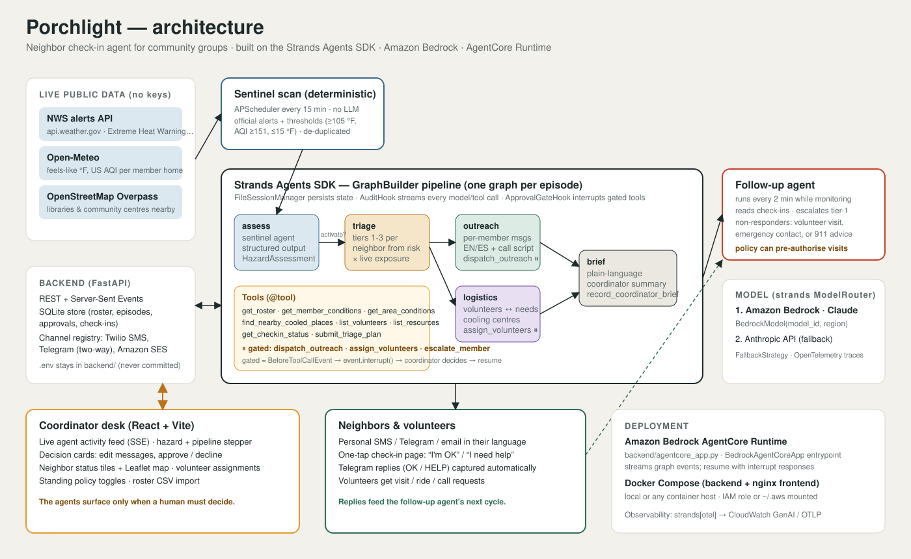

# Porchlight

**A neighbor check-in agent for community groups, built with the Strands Agents SDK.**
When an Extreme Heat Warning, smoke event, freeze, or outage threatens a neighborhood, Porchlight works in the background: it reads the official alert, figures out which neighbors are actually in danger, writes each of them a personal message in their language, lines up volunteers and cooling centers, and then pauses so the block captain can approve with one click. After the messages go out it keeps watching the replies and escalates the people who never answer.

*Agents for Humans Hackathon · Good Neighbor Agents track · MIT licensed*



## The problem

Extreme heat kills more people in the United States than any other weather hazard, and the people who die are overwhelmingly older adults living alone, without air conditioning, who nobody checked on. Maricopa County (Phoenix) confirmed **645 heat-associated deaths in 2023** ([county report](https://www.maricopa.gov/1858/Heat-Surveillance)). During the 2021 Pacific Northwest heat dome most of the people who died in Multnomah County were older, lived alone, and had no working air conditioning ([county review](https://www.multco.us/multnomah-county/news/heat-related-deaths-multnomah-county-june-2021)). Public-health guidance during every heat wave is the same sentence: *check on your neighbors.*

That job falls on volunteers: block captains, church phone trees, senior-center staff, mutual-aid groups. Their "system" is a spreadsheet and a group text. During an event they are stuck doing the same thing, over and over: reading a weather alert, guessing who is at risk, typing individual texts in two languages, calling around for someone with a car, and then trying to remember who never wrote back.

## Who it is for

The one volunteer who holds a community's contact list together: a block captain, a parish coordinator, a senior-building resident manager, a mutual-aid dispatcher. Porchlight gives them an agent that does the repetitive part and surfaces only when a human should decide.

## What the agent does

| Step | Strands agent | What happens |
|---|---|---|
| Watch | Sentinel scan (deterministic, no LLM) | Polls National Weather Service alerts for the roster's location and live feels-like temperature and air quality from Open-Meteo every 15 minutes. Opens an episode when a relevant alert or threshold appears. |
| Assess | `assess` node | Reads the alert text and live conditions, returns a typed `HazardAssessment` (activate or stand down, severity, which risk factors are elevated, plain-language summary). |
| Triage | `triage` node | Ranks every neighbor into tiers from their risk factors (lives alone, no AC, oxygen concentrator, dialysis, memory issues, young kids, works outdoors) and live conditions at their home. |
| Outreach | `outreach` node | Drafts a personal message per neighbor in English or Spanish with one concrete action and a one-tap check-in link. Calls `dispatch_outreach`, which **pauses for the coordinator**. |
| Logistics | `logistics` node | Matches volunteers to tier-1 neighbors by skill (Spanish, driver, nurse), proximity and load; finds the nearest real cooling center. Calls `assign_volunteers`, which **pauses for the coordinator**. |
| Brief | `brief` node | Writes a plain-language brief: who was contacted, who is visiting whom, what gaps remain, what the coordinator should do next. |
| Follow up | `followup` agent | Every two minutes while monitoring: reads check-in replies, escalates "I need help" and tier-1 non-responders (volunteer visit, emergency contact, 911 advice). Each escalation pauses for approval unless the coordinator's standing policy pre-authorises it. |

The coordinator sees all of it on one screen: live agent activity, a decision card with editable messages, neighbor status tiles, a map, and the brief. Neighbors see a single page with two very large buttons.

## How it uses Strands Agents

- **`GraphBuilder` multi-agent pipeline** (`backend/app/agents/pipeline.py`): five agents with distinct system prompts and tool sets, a conditional edge (`assess -> triage` only when the assessment says activate), and parallel branches (`outreach` and `logistics`) that join at `brief`.
- **Human-in-the-loop with interrupts** (`backend/app/agents/hooks.py`): `ApprovalGateHook` registers on `BeforeToolCallEvent` and calls `event.interrupt()` for every world-changing tool. The graph stops with `Status.INTERRUPTED`; the API turns each interrupt into an approval card; the coordinator's decision is fed back as an `interruptResponse` and the graph resumes exactly where it paused. A declined action sets `event.cancel_tool` with a message the agent can reason about. Edited messages are written back into `tool_use["input"]`.
- **Session persistence**: every graph and the follow-up agent use `FileSessionManager`; the runner rebuilds a paused graph from its session when an approval arrives after a restart.
- **Structured output**: the sentinel agent returns a Pydantic `HazardAssessment` via `structured_output_model`; the graph edge condition reads it.
- **Tools with context**: `@tool(context=True)` tools read the episode id from `invocation_state`, so one tool module serves every agent in every episode.
- **Hooks for observability**: `AuditHook` mirrors `BeforeModelCallEvent`, `BeforeToolCallEvent`, `AfterToolCallEvent` and `MessageAddedEvent` into a server-sent event stream and the episode timeline, which is what the dashboard's live feed shows.
- **Streaming**: `graph.stream_async()` node events drive the pipeline stepper; `agent.stream_async()` text deltas are forwarded live.
- **`ModelRouter` with fallback**: Amazon Bedrock first, then the Anthropic API, then a local Ollama model, so the same code runs offline during development.
- **AgentCore Runtime entrypoint** (`backend/agentcore_app.py`): `BedrockAgentCoreApp` with a streaming `@app.entrypoint` that runs the identical graph and resumes on interrupt responses.
- **Deterministic guardrails outside the LLM**: thresholds, alert filtering and de-duplication live in `sentinel.py`; the model never decides whether to poll, only what to do once a real hazard exists.

## Repository layout

```
backend/                  Python 3.11+ · FastAPI · Strands Agents SDK
  app/agents/             pipeline.py (graph), tools.py, hooks.py, runner.py, sentinel.py, model_factory.py
  app/feeds/              nws.py, open_meteo.py, places.py (public APIs, no keys)
  app/channels/           twilio_sms.py, telegram.py, ses_email.py, console.py, registry.py
  app/data/fixtures/      real archived NWS alerts for reproducible replays
  app/main.py             REST + SSE API
  agentcore_app.py        Amazon Bedrock AgentCore Runtime entrypoint
  tests/smoke_strands.py  verifies interrupts, resume, sessions, structured output, graph
  .env.example            all configuration; copy to backend/.env (never committed)
frontend/                 React 18 · Vite · Leaflet
  src/pages/              Dashboard (coordinator desk), Checkin (neighbor page), Roster
docs/                     architecture diagram, demo script, builder.aws.com post drafts
docker-compose.yml        backend + nginx-served frontend
```

## Run it locally

Prerequisites: Python 3.11+, Node 20+, and one model provider (AWS credentials with Bedrock model access, or an Anthropic API key, or Ollama).

```bash
# backend
cd backend
python -m venv .venv && source .venv/bin/activate
pip install -r requirements.txt
cp .env.example .env            # edit: model provider, channels, PUBLIC_BASE_URL
python run.py                   # http://localhost:8000

# frontend (second terminal)
cd frontend
npm install
npm run dev                     # http://localhost:5173  (proxies /api to the backend)
```

Open the desk, press **Replay this alert** (a real Extreme Heat Warning from NWS Phoenix, archived in `backend/app/data/fixtures/`), and watch the agents work. When the decision card appears, edit a message if you like and press **Approve & send**. Open one of the check-in links printed in the activity feed (or the SMS if a channel is configured) and tap **I need help**; the follow-up agent escalates.

Or point the roster somewhere with weather right now: edit `backend/app/seed.py` coordinates, reset the database, and press **Scan now**.

### Bedrock preflight

Model access is the most common blocker. Before the first run, confirm your account can invoke the configured model:

```bash
aws bedrock list-foundation-models --region us-east-1 --by-provider anthropic --query 'modelSummaries[].modelId'
python -c "from strands import Agent; print(Agent(model='global.anthropic.claude-sonnet-4-6', callback_handler=None)('Say ready.'))"
```
If the model id is not enabled for your account, request access in the Bedrock console (Model access) or set `BEDROCK_MODEL_ID` to one that is.

### Model configuration (`backend/.env`)

| Setting | Purpose |
|---|---|
| `MODEL_PROVIDER=auto` | Bedrock, then Anthropic, then Ollama, through `strands.models.ModelRouter` |
| `BEDROCK_MODEL_ID`, `AWS_REGION` | Bedrock model; credentials come from the standard AWS chain or `AWS_BEARER_TOKEN_BEDROCK` |
| `ANTHROPIC_API_KEY` | optional fallback |
| `OLLAMA_HOST`, `OLLAMA_MODEL` | optional offline fallback (tested with `qwen2.5:3b`; use a 7B+ model for good triage) |

### Real messages

`SEND_MODE=console` (default) logs every message instead of sending. Set `SEND_MODE=live` and configure any of: Twilio (`TWILIO_ACCOUNT_SID`, `TWILIO_AUTH_TOKEN`, `TWILIO_FROM_NUMBER`), Telegram (`TELEGRAM_BOT_TOKEN`, members need a `telegram_chat_id`; replies of "OK" or "HELP" are captured automatically), or Amazon SES (`SES_FROM_EMAIL`). `DEMO_OVERRIDE_PHONE` / `DEMO_OVERRIDE_EMAIL` route every outbound message to one address you control, which is how the demo video was recorded without texting fictional neighbors.

### Docker

```bash
cp backend/.env.example backend/.env   # edit
docker compose up --build              # http://localhost:5173
```

## Deploy the agent to Amazon Bedrock AgentCore Runtime

```bash
npm install -g @aws/agentcore
cd backend
agentcore create          # framework: Strands · entrypoint: agentcore_app.py · model: Bedrock
agentcore deploy
agentcore invoke '{"action": "replay", "fixture_id": "nws_phoenix_extreme_heat_warning_2026-09-08"}'
# resume after the coordinator decides:
agentcore invoke '{"action": "resume", "episode_id": "<id>", "interrupt_responses": [{"interruptId": "<id>", "response": {"decision": "approve"}}]}'
```

The runtime entrypoint streams graph events and interrupt payloads; the FastAPI service can be pointed at it instead of running the graph in-process. Observability: install `strands-agents[otel]` (already in requirements) and set `OTEL_EXPORTER_OTLP_ENDPOINT`, or enable CloudWatch GenAI Observability on the runtime.

## Testing

```bash
cd backend && python -m tests.smoke_strands
```
Exercises, on the configured model: a `BeforeToolCallEvent` interrupt, resume from a `FileSessionManager` session in a fresh `Agent`, tool execution after approval, `structured_output_model`, and a `Graph` whose node interrupts and then resumes to completion.

## Safety and privacy

- No message, volunteer dispatch or escalation leaves the system without a coordinator decision, unless the coordinator has explicitly enabled the one standing policy (auto-dispatch a volunteer to a tier-1 neighbor who has not replied).
- The roster in this repo is fictional; the coordinates and cooling centers are real Maryvale, Phoenix locations chosen because NWS Phoenix issues real Extreme Heat Warnings the agent can act on live.
- Porchlight is a coordination aid for volunteers, not an emergency service. The check-in page tells neighbors to call 911 for symptoms of heat stroke.
- `backend/.env` holds every secret and is git-ignored. Scan the repo before publishing.

## Built with

Strands Agents SDK 1.55 (Python) · Amazon Bedrock (Claude) · Amazon Bedrock AgentCore Runtime · FastAPI · React + Vite · Leaflet/OpenStreetMap · National Weather Service API · Open-Meteo · Twilio / Telegram / Amazon SES

AI coding assistants were used for boilerplate, tests and debugging, as permitted by the hackathon rules. All code was written during the submission period.

## License

MIT, see [LICENSE](LICENSE).
